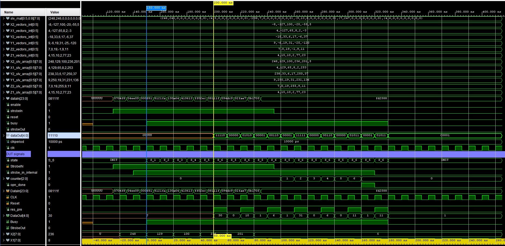
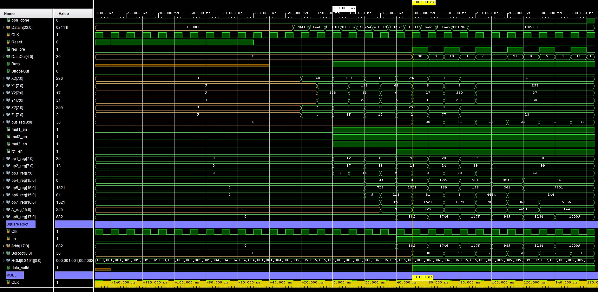

# Distance_Calculator
A VHDL program to calculate euclidean distance of a set of X, Y, Z points

# Folders

* hw 
  1. distance_v2.vhdl
  1. sqrtROM.vhdl
* python
  1. gen-sqrtROM.py
  1. sqrtROM.txt
* sim
  1. tb.vhdl

## Distance_v2.vhdl

``` vhdl
entity Distance_v2 is
  Port (
    DataIn : in STD_LOGIC_VECTOR (23 downto 0); -- Data Input
    CLK : in STD_LOGIC; -- Clock
    StrobeIN : in STD_LOGIC; -- Strobe In for control
    Reset : in STD_LOGIC; -- Reset
    DataOut : out STD_LOGIC_VECTOR (4 downto 0) := (others => '0'); -- Data Output
    Busy : out STD_LOGIC; -- Busy stage
    StrobeOut : out STD_LOGIC); -- Strobe out   
end Distance_v2;
```

Entity of the main module is shown above. It receives 3 coordinates, 8 bits each, 

<figure style="text-align: center;">
  
  <figcaption>Figure 1: Simulation timing diagram (Part 1)</figcaption>
</figure>

<figure style="text-align: center;">
  
  <figcaption>Figure 2: Simulation timing diagram (Part 2)</figcaption>
</figure>