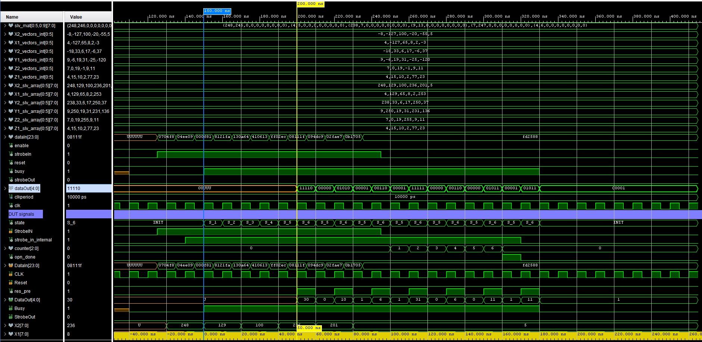
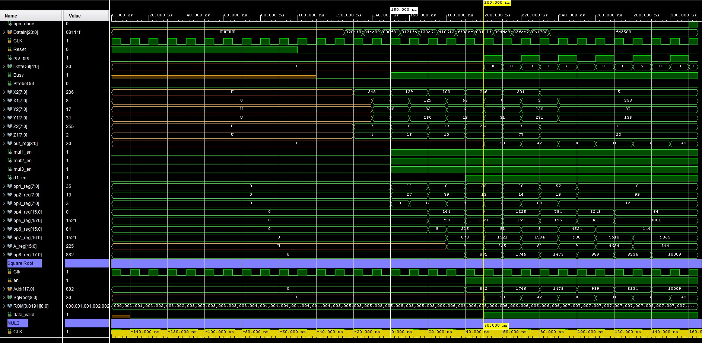

# Distance_Calculator
A VHDL program to calculate euclidean distance of a set of X, Y, Z points. The project was tried on the Zedboard but there was a bitgen error with the pins and is not resolved. The program was run on Vivado 2023.2. Python code is used to generate a text file for the square root ROM module.

# Folders

* hw 
  1. Distance_v2.vhdl
  1. sqrtROM.vhdl
* python
  1. gen-sqrtROM.py
  1. sqrtROM.txt
* sim
  1. tb.vhdl

## Distance_v2.vhdl Entity

``` vhdl
entity Distance_v2 is
  Port (
    DataIn : in STD_LOGIC_VECTOR (23 downto 0); -- Data Input
    CLK : in STD_LOGIC; -- Clock
    StrobeIN : in STD_LOGIC; -- Strobe In for control
    Reset : in STD_LOGIC; -- Reset
    DataOut : out STD_LOGIC_VECTOR (4 downto 0) := (others => '0'); -- Data Output
    Busy : out STD_LOGIC; -- Busy stage
    StrobeOut : out STD_LOGIC); -- Strobe out   
end Distance_v2;
```

Entity of the main module is shown above. It receives 3 coordinates, 8 bits each for a total of 24 bits. The result is  

## Simulation Results

For example: <br>
X2 = -8, X1 = 4 => $(X2 - X1)^2 = (-12)^2 = 144$ <br>
Y2 = -18, Y1 = 9 => $(Y2 - Y1)^2 = (-27)^2 = 729$ <br>
Z2 = 7, X1 = 4 => $(Z2 - Z1)^2 = (3)^2 = 9$ <br>

$Distance = \sqrt{(X2-X1)^2 + (Y2-Y1)^2 + (Z2 - Z1)^2} = \sqrt{144 + 729 + 9} = \sqrt{882} \approx 30$

Please refer to "882" in row sqRoot[8:0] in Figure 2 and its corresponding square root displayed as 30 in row dataOut[4:0] in Figure 1. Note the numbers shown are unsigned for 5 bits and the full result in shown in 2 dataOut bus changes. 
<figure style="text-align: center;">
  
  <figcaption>Figure 1: Simulation timing diagram (Part 1)</figcaption>
</figure>

<figure style="text-align: center;">
  
  <figcaption>Figure 2: Simulation timing diagram (Part 2). Continuation of previous diagram. There is some overlap. </figcaption>
</figure>